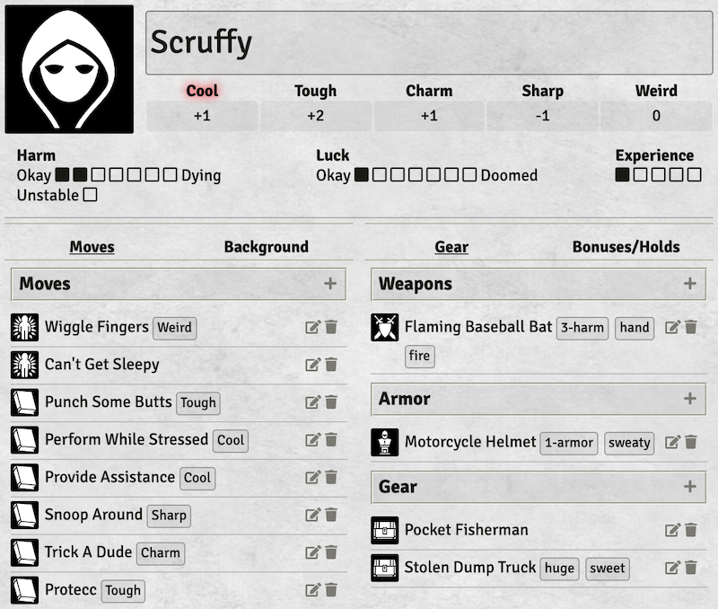
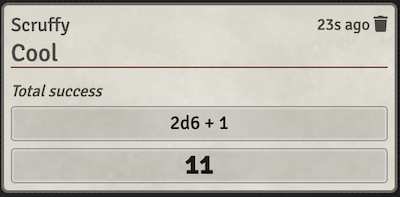
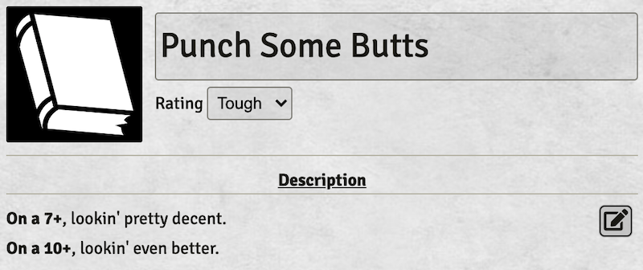

# Alternate Monster of the Week

A simple, unofficial [Foundry VTT](https://foundryvtt.com/) system for
[Evil Hat Productions](https://www.evilhat.com/)'s [Monster of the
Week](https://www.evilhat.com/home/monster-of-the-week/).

The text from Monster of the Week used in this system is copyright Evil Hat
Productions and Generic Games. Used with permission.

## Installing

In your Foundry VTT instance:

- Enter "Setup" mode
- Go to the "Game Systems" tab
- Click "Install System"
- In the "Filter Packages" field in the upper right, search for "Alt Monster/Week"
- Click "Install" on the entry that shows up

There is currently not a foundry package for this version of monster/week

## Overview

Includes:

- Basic hunter/move/gear sheets
- Rollable ratings: click on the Cool/Tough/Charm/etc. header on the hunter
  sheet to see the roll in the chat window, with a header for "total success",
  "mixed success", or "failure".
- Compendium entries for basic and hunter moves from the core MotW rulebook.
- A "Playbook Templates" compendium with starter sheets for the basic set of
  Hunter types. The "Background" and "Bonuses/Holds" tabs of the sheets
  include extra hunter info.

Doesn't include:

- First-class tracking for advancements, although the "Bonuses/Holds" tab
  in the template sheets include free-form text for tracking them.
- Ways to represent hunter-specific concepts like
  the Pararomantic's "Relationship status" track, the Hex's Rotes, or
  the Spell-Slinger's spells
    - You could use "Gear" entries to represent rotes/spells
    - Relationship status or other similar things could live as freeform text
      in the Background or Bonuses/Holds tabs.

Not a lot, but enough to get a game going. Feel free to file issues, or send
pull requests or translations! This is my first javascript thing, so I'll do
my best. :)

This system is released under the MIT license described in
[LICENSE.txt](LICENSE.txt), and its copyright belongs to its contributors.

Forked from the [Simple Worldbuilding
System](https://gitlab.com/foundrynet/worldbuilding). (This version is forked from [Dave Bort's Monster/Week](https://gitlab.com/3cell/monsterweek/activity))

## Screenshots

### Hunter

Create by creating an actor, and choosing "hunter" as the type.

To change the value of a rating ("Cool", "Tough", etc.), type in the number and
hit enter. Rating values are not restricted to the range from -1 to +3 based on the
rules, just in case you are using a house rule that can get you higher or lower.

To roll, click the rating word ("Cool", etc.) at the top of the sheet. The
chat message will tell you what kind of success/failure it was.

Increase or decrease marks on the Harm/Luck/etc. tracks by clicking on the left
or right ends; no need to click on exactly the next box, though that works too.
You can also click on one of the icons found on either side of the track, which move the track in their direction.

The "Background" and "Bonuses/Holds" tabs are freeform text, for keeping track
of stuff that isn't fully supported by the system.

### Move

Create by using the "+" icon in the header of the Moves list on the Hunter
sheet, or creating a new item in the "Items" chat tab and selecting "move" as
the type.

You can also drag in Moves from the included compendiums.

If the move typically requires rolling a specific rating, you can select it in
the drop-down at the top, and it will appear as a chip on the hunter sheet.

Those chips do not currently trigger a roll, but they let you know which rating
to roll without needing to open the move.

### Gear/Weapon/Armor

Create by using the "+" icon in the headers of the Weapons/Armor/Gear sections
on the Hunter sheet, or creating a new item in the "Items" chat tab and
selecting "weapon"/"armor"/"gear" as the type.

Tags are space-separated, and will appear as chips on the hunter
sheet.

## Future features

- Luck:
  - Add a spot for the hunter luck rules; maybe pop it up when clicking
    the "Luck" label. E.g., "Crooked special: Whenever you spend a Luck point,
    someone from your past will re-appear in your life. Soon."
    (See "updated luck rules" playbooks at
    https://www.evilhat.com/home/monster-of-the-week-resources/)
- Moves:
  - Rolling from moves is a pretty important step, also want to structure them better.
  - Structure the 10+/7-9/fail text so it can be displayed in chat
  - Would be cool to automatically add holds, though that could get
    annoying if most of the holds are used immediately; may be better
    to do it in chat with a button to remember the hold for later.
  - Some gear can provide custom moves. Would be nice if owning that gear
    added the move to the owner's list.
  - Leveling up can change basic moves to Advanced Moves (p122) which gives
    them extra effects on 12+.
- Weapons:
  - Keep the freeform tag system but also include some predefined tag options that can also be ignored if preffered without things breaking, so that things like harm     and range can be treated better. Especially once you can display weapons in chat. 
- Hunter specials:
  - The Hex's Rotes (spells). Could treat them as special
    moves, since they follow from Use Magic, or could create a new type
    of thing for them. Could still appear in the Moves tab, just under
    a Rotes section
  - Pararomantic's "Relationship status" track
  - Spell-slinger has spells with tags, and some provide both harm and
    armor. A new category beyond armor/weapon/gear? Or do we mix them
    all together and maybe cluster by "magic", "#-harm", "#-armor", etc.
- Armor:
  - Would be nice to roll up all armor into a single top-level view,
    adding all N-armor and highlight tags like 'magic'. Clicking on it
    would switch to the gear/armor tab.
- Armor, Weapons, Gear:
  - Allow gear of any kind to be displayed in chat, for easier access by dm's and for general memeness
- Misc:
  - Big "DOOMED" stamp across avatar when luck is completely full
